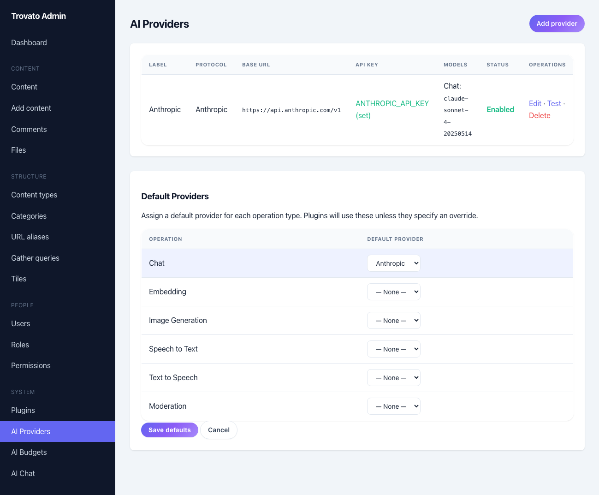
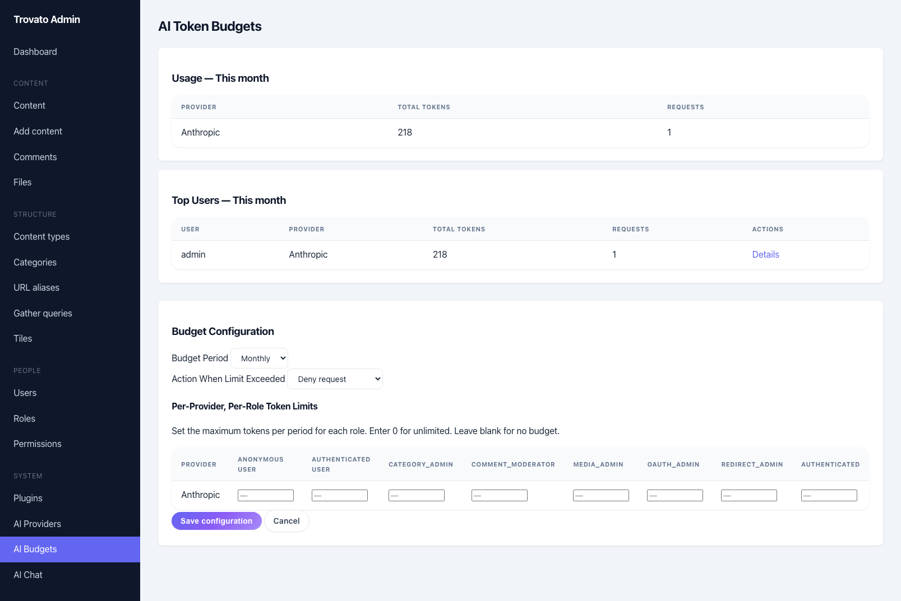
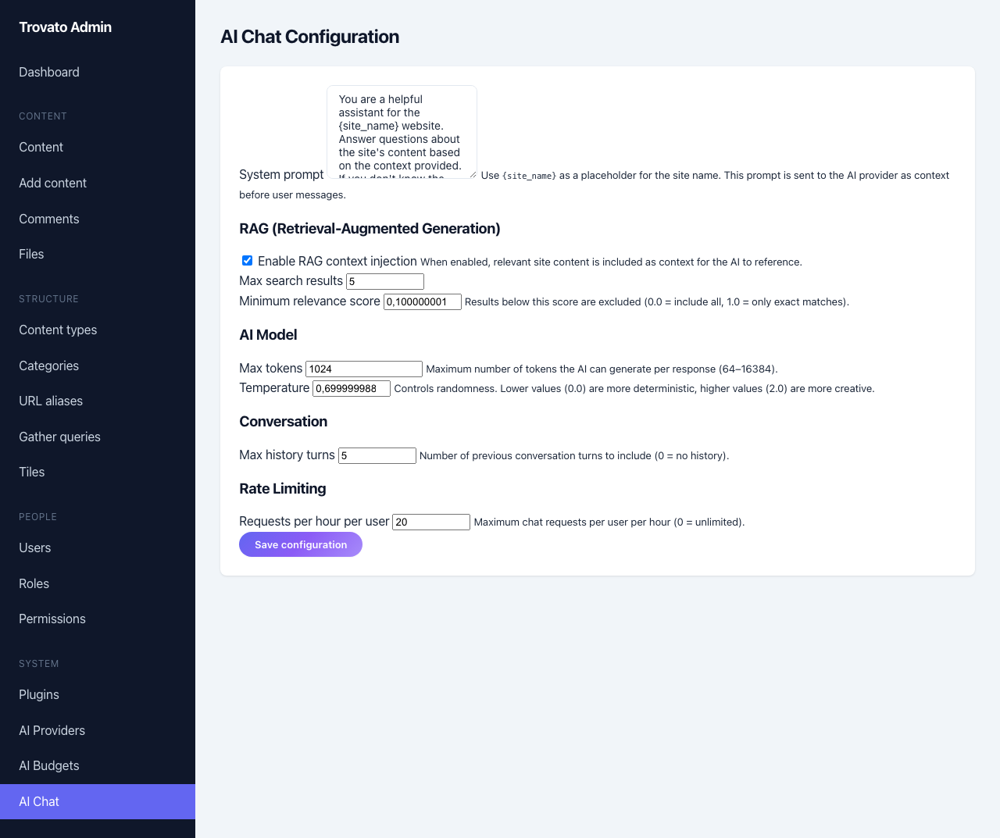
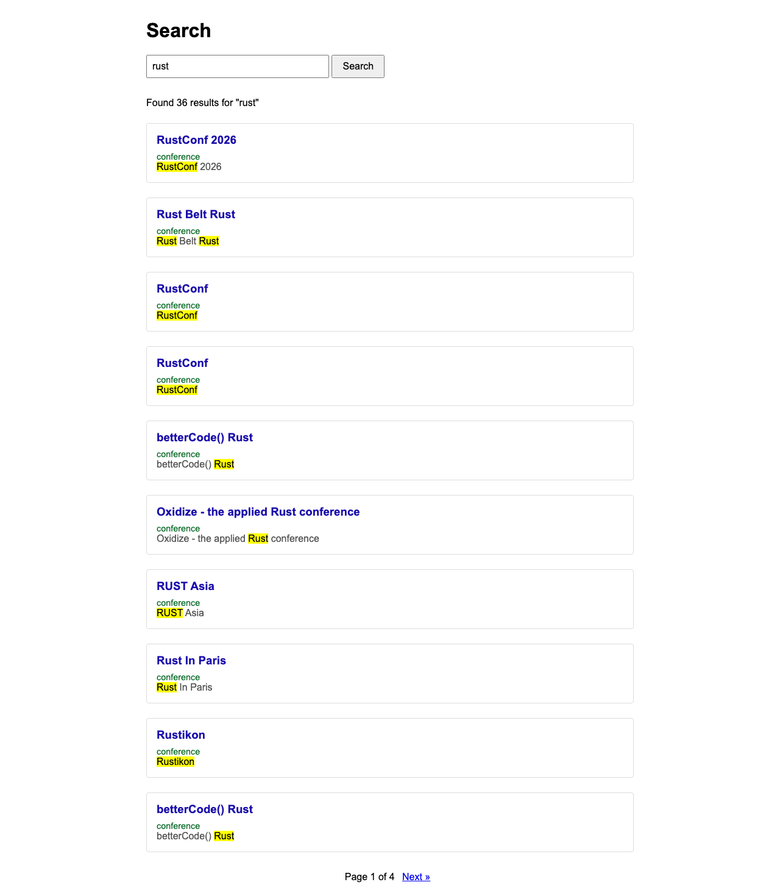

# Epic 3: AI as a Building Block

**Tutorial Part:** Supporting (spans Phase 4-5 kernel + Phase 6 plugins)
**Trovato Phase Dependency:** Phase 4 (Stages, Permissions), Phase 5 (Form API, Theming)
**BMAD Epic:** 31
**Status:** Complete. All stories implemented. Phase A: provider registry, ai_request host function, token budgets, permissions. Phase B: field rules (tap_item_presave), form AI assist (tap_form_alter + /api/v1/ai/assist + JS popover), VectorStore trait + pgvector. Phase C: SSE streaming chatbot + RAG, Scolta AI search (expand/summarize/followup endpoints + scolta.js client). Phase D: MCP server. Scolta provides AI-powered search without requiring a vector database — Pagefind handles client-side indexing, AI handles query expansion and summarization.

---

## Narrative

*Your conference site has content and search. Now you teach the system to think. But unlike bolting AI onto the side, you wire it in as infrastructure -- a host function any plugin can call, with the kernel managing keys, budgets, and providers so plugins never touch credentials.*

This epic implements the [AI Integration design](../design/ai-integration.md) in four phases: kernel foundation (provider registry, `ai_request()` host function, key store, token budgets), content enrichment (field rules that fire on save), conversational search and chatbot (SSE / Server-Sent Events streaming, RAG / Retrieval-Augmented Generation context), and MCP (Model Context Protocol) integration (exposing Trovato to external AI tools).

The guiding principle: **AI never publishes.** Every AI-initiated content mutation flows through the Stage system. Editors review AI work the same way they review human work -- no separate "AI review queue." The same editorial pipeline, the same permissions, the same audit trail.

---

## Tutorial Steps

### Step 1: AI Core -- Provider Registry & Host Function

Configure an AI provider (OpenAI, Anthropic, or a local Ollama instance) and make your first `ai_request()` call from a plugin. The kernel handles API keys, rate limits, and token tracking -- plugins just describe what they want.

**What to cover:**

- The `ai_request()` host function: one function, any provider, any operation type
- Provider configuration via site config (env vars for keys, database for provider defaults)
- Operation types: Chat, Embedding, ImageGeneration, SpeechToText, TextToSpeech, Moderation
- The secure key store: API keys in env vars or config file, never in the database, never crossing the WASM boundary
- Token budget tracking: per-vendor, per-role, per-user, configurable periods (daily/weekly/monthly)
- Admin UI: add providers, test connection, set defaults per operation type
- AI permissions: `use ai`, `use ai chat`, `configure ai`, `view ai usage`

Call `ai_request(operation: Chat)` from a test plugin with a simple prompt. See the response, see the token usage logged.

### Step 2: Content Enrichment -- Field Rules

Configure AI field rules that fire on a new `tap_item_presave` tap. When a conference description changes, AI auto-generates a summary. When an image is uploaded without alt text, AI generates it. The `trovato_ai` plugin reads field rule configuration and enriches content before save.

**Note:** The existing `tap_item_insert` and `tap_item_update` taps fire *after* save, which is too late for enrichment that should be part of the saved content. Story 31.5 introduces `tap_item_presave` as a new tap that fires before the item is persisted, giving plugins the opportunity to modify fields.

**What to cover:**

- Field rule configuration: item_type, field, trigger, operation, prompt, target_field, behavior, weight
- Behaviors: `fill_if_empty` (only when target is blank), `always_update` (every save), `suggest` (UI only), `validate` (block/allow)
- Chaining: lower-weight rules run first; a summary rule can reference the output of a prior enrichment
- Stage integration: when AI modifies an item on the live stage (public visibility), the change creates a new revision on a stage with internal visibility (see [design decision D8](../design/ai-integration.md#d8-stage-based-human-in-the-middle-for-all-ai-mutations))
- Per-field staging overrides: alt-text can update in place; body changes go through full editorial review
- Audit trail: AI changes recorded with model, prompt, and input/output in revision metadata
- Admin UI: visual field rule editor with drag-to-reorder

Create a field rule: when `conference.description` changes, auto-fill `conference.summary`. Save a conference, see the summary appear. Check the revision log -- it shows "AI: auto-summary via openai/gpt-4o."

### Step 3: Form Assistance & AI Assist Buttons

Add AI-powered assistance directly in content editing forms. The `trovato_ai` plugin uses `tap_form_alter` to inject "AI Assist" buttons next to text fields, category fields, and image uploads.

**What to cover:**

- `tap_form_alter` for injecting AI Assist buttons into content forms (this tap already exists in the kernel)
- Text field operations: rewrite, expand, shorten, translate, adjust tone
- Category suggestion: analyze content, suggest terms from existing categories
- Alt-text generation: generate from uploaded image (requires multimodal model or image-to-text operation)
- Inline UI: popover with operation buttons, streamed preview, accept/reject
- All operations go through `ai_request()` -- same provider, same budget, same rate limits
- Requires `use ai chat` permission to see AI Assist buttons

Edit a conference, click "AI Assist" next to the description field. Choose "Shorten." See the AI-suggested shorter version, accept or reject it.

### Step 4: Chatbot Tile & RAG

Build a conversational chatbot Tile that can answer questions about site content. The plugin registers an SSE endpoint, injects RAG context from search results, and streams responses token-by-token.

**What to cover:**

- Chat Tile: Tera template + vanilla JS, placeable in any Slot
- `/api/v1/chat` endpoint: POST message, stream SSE response
- System prompt configuration: site personality, instructions, boundaries
- RAG context: search query on user message (Pagefind results or Gather), inject top results as context
- Access control: Gather queries enforce role-based permissions -- chatbot never leaks restricted content
- Conversation history: session-scoped, configurable max depth (default 5 turns)
- Actions (tool calling): search content, navigate, subscribe -- described to LLM via function calling
- Rate limiting: per-role via Tower middleware
- SSE streaming: word-by-word response, connection auto-reconnect

Place the chatbot Tile in the sidebar Slot. Ask "What Rust conferences are in Europe?" See results pulled from content, cited with links, streamed in real time.

### Step 5: MCP Server

Expose Trovato as an MCP server so external AI tools (Claude Desktop, Cursor, VS Code) can interact with site content. The `trovato_mcp` plugin surfaces CRUD (Create, Read, Update, Delete), search, and Gather as MCP tools.

**What to cover:**

- `trovato_mcp` plugin registers MCP endpoints via `tap_menu`
- Tools: content CRUD, search, Gather queries, user management
- Resources: content types, recent items, site configuration
- Authentication: MCP client authenticates as a Trovato user; that user's role determines available tools
- Permission enforcement: same access control as REST API
- Separate from `trovato_ai` -- MCP exposes Trovato to external tools; `trovato_ai` brings AI into Trovato

Connect Claude Desktop to the Ritrovo MCP server. Ask Claude to "find upcoming Rust conferences and create a summary page." Watch it use the Gather tool to query content and the content CRUD tool to create an Item.

---

## Hands-On Walkthrough

This walkthrough shows AI features working against a real Trovato instance with an Anthropic API key.

### 1. Enable the AI Plugin

```bash
# Enable trovato_ai (disabled by default)
docker compose --profile full exec trovato ./trovato plugin enable trovato_ai
docker compose --profile full restart trovato
```

### 2. Configure an AI Provider

Set your API key as an environment variable (never stored in code):

```bash
# Add to docker-compose.override.yml (gitignored):
# services:
#   trovato:
#     environment:
#       ANTHROPIC_API_KEY: sk-ant-...
```

Then configure the provider via the admin UI at `/admin/system/ai-providers`:

[](../tutorial/images/part-ai/ai-config-providers.png)

The provider configuration stores the **environment variable name** (`ANTHROPIC_API_KEY`), not the key itself. The kernel resolves the key from the environment at runtime. Keys never enter the database and never cross the WASM boundary to plugins.

### 3. Token Budgets & Usage

Monitor AI usage and set per-role token budgets at `/admin/system/ai-budgets`:

[](../tutorial/images/part-ai/ai-budgets.png)

### 4. Chat Configuration

Configure the chatbot system prompt, RAG settings, and rate limits at `/admin/system/ai-chat`:

[](../tutorial/images/part-ai/ai-chat-settings.png)

### 5. AI Assist on Content Forms

When `trovato_ai` is enabled, text fields in content forms gain AI Assist buttons. Click "AI Assist" to rewrite, expand, shorten, translate, or adjust tone — all powered by your configured provider.

The AI Assist endpoint (`POST /api/v1/ai/assist`) accepts text and an operation, calls the AI provider, and returns the transformed text. The user can preview the result and accept or reject it.

### 6. Scolta AI Search

Search at `/search` uses Pagefind for instant client-side results. When AI is enabled, three additional features activate:

- **Query expansion**: "performance issues" also finds "site speed optimization"
- **AI summary**: A streaming answer appears above results, citing sources
- **Follow-up conversation**: Ask follow-up questions about search results

[](../tutorial/images/part-ai/search-scolta.png)

> **Note:** The screenshot shows the tsvector server-side fallback. When Pagefind is installed and the index has been built (via cron), scolta.js provides instant client-side search with scoring and AI features.

### 7. Test AI Directly

Verify AI is working with a curl command:

```bash
# Get a CSRF token
CSRF=$(curl -s -b cookies.txt http://localhost:3001/admin \
  | grep -oE 'csrf-token" content="[a-f0-9]+"' | grep -oE '[a-f0-9]{64}')

# Test AI assist
curl -s -b cookies.txt \
  -X POST http://localhost:3001/api/v1/ai/assist \
  -H "Content-Type: application/json" \
  -H "X-CSRF-Token: $CSRF" \
  -d '{"text": "Trovato is a CMS built in Rust.", "operation": "expand"}'
```

Expected response: AI-expanded text with more detail about Trovato's Rust foundation.

---

## BMAD Stories

### Story 31.1: AI Provider Registry & Secure Key Store

**Status:** Complete. `AiProviderConfig` struct, `AiOperationType` enum (6 types), provider config in site_config, API keys via env vars (never in DB/WASM), admin UI at /admin/config/ai with CRUD + connection test. Implemented in `services/ai_provider.rs` (848 lines) and `routes/admin_ai_provider.rs`.

**As a** site administrator,
**I want to** configure AI providers with securely stored API keys,
**So that** plugins can use AI services without managing credentials.

**Acceptance criteria:**

- `AiProviderConfig` struct with id, api_key_ref, base_url, models per operation type, rate limit
- `AiOperationType` enum: Chat, Embedding, ImageGeneration, SpeechToText, TextToSpeech, Moderation
- Provider config stored in site config (database-backed, admin-editable)
- API keys stored in environment variables (production) or config file (development), referenced by name
- Keys never stored in the database, never exposed in admin UI after entry (masked display)
- Keys never accessible to WASM plugins -- kernel injects keys during `ai_request()` execution
- Site-wide default provider per operation type, overridable per request
- Admin UI: add/edit/remove providers, select key reference, set default models, test connection button
- Connection test verifies the provider is reachable and the key is valid

### Story 31.2: `ai_request()` Host Function

**Status:** Complete. `ai_request()` host function in `host/ai.rs` (959 lines). OpenAI-compatible + Anthropic protocols. Per-provider rate limiting. SDK types in `types.rs`: `AiRequest`, `AiResponse`, `AiMessage`, `AiOperationType`, `AiRequestOptions`. SDK binding in `host.rs`.

**As a** plugin developer,
**I want to** call a single host function to make AI requests,
**So that** I can use any AI provider without managing connections or credentials.

**Acceptance criteria:**

- `ai_request()` host function registered in `crates/kernel/src/host/` module
- Accepts `AiRequest` with operation type, optional model override, messages/input, and options (max_tokens, temperature, etc.)
- Resolves provider from site config based on operation type
- Injects API key from secure key store before making HTTP request
- Makes HTTP request to provider API (OpenAI-compatible, Anthropic, or custom endpoint)
- Returns normalized `AiResponse` with content, token usage (prompt + completion), model used, and latency
- Enforces rate limits: per-provider, per-role, per-plugin configurable limits
- Logs every request: token count, latency, model, calling plugin, user (for observability)
- Handles provider errors gracefully: timeout, rate limit, auth failure, malformed response
- SDK types added to `crates/plugin-sdk/src/types.rs`: `AiRequest`, `AiResponse`, `AiMessage`, `AiOperationType`, `AiRequestOptions`
- SDK host binding added to `crates/plugin-sdk/src/host.rs`: `ai_request(request_json: &str) -> Result<String, i32>`

### Story 31.3: Token Budget Tracking

**Status:** Complete. Token usage tracked per request in `ai_usage_log` table. Per-user/per-role budgets with daily period. Budget enforcement in ai_request. Admin UI at /admin/config/ai/budgets. Implemented in `services/ai_token_budget.rs` (722 lines).

**As a** site administrator,
**I want to** set token usage limits per role and provider,
**So that** AI costs are predictable and controllable.

**Acceptance criteria:**

- Token usage tracked per request from provider response metadata (prompt tokens + completion tokens)
- Usage stored per-vendor, per-user with configurable period (daily, weekly, monthly)
- Per-role default budgets configurable in site config (e.g., authenticated: 10K tokens/month, editor: 50K, admin: unlimited)
- Per-user override stored in user record, editable in admin UI
- Budget enforcement: `deny` (reject request), `warn` (allow but log warning), `queue` (defer for later)
- `ai_request()` checks budget before making provider call; returns budget-exceeded error when `deny` is active
- Admin UI: usage dashboard showing burn-down by provider, role, and user over the configured period
- Usage log feeds the dashboard (same log from Story 31.2 observability)
- Budget resets automatically at the start of each period

### Story 31.4: AI Permissions

**Status:** Complete. Six permissions via `tap_perm` in trovato_ai: `use ai`, `use ai chat`, `use ai embeddings`, `use ai image generation`, `configure ai`, `view ai usage`. Permission checks in ai_request host function and all AI endpoints.

**As a** site administrator,
**I want** granular permissions for AI features,
**So that** I can control which roles have access to which AI operations.

**Acceptance criteria:**

- Permissions declared via `tap_perm` in `trovato_ai` plugin: `use ai`, `use ai chat`, `use ai embeddings`, `use ai image generation`, `configure ai`, `view ai usage`
- `ai_request()` checks `use ai` base permission plus operation-specific permission before executing
- Rate limits composable with permissions: a role can have `use ai chat` with 20 req/hr
- Admin UI integrates with existing role-permission management
- Anonymous users without `use ai` receive a clean "AI features require authentication" response, not a generic error
- `configure ai` required for provider management, field rules, and chat settings
- `view ai usage` required for the usage dashboard

### Story 31.5: Content Enrichment Field Rules

**Status:** Complete. `tap_item_presave` in trovato_ai reads field rules from site_config, filters by item_type, builds prompts with `{field_name}` substitution, calls ai_request(), applies results (fill_if_empty, always_update). Presave dispatch added to both create and update paths in ItemService.

**As a** content editor,
**I want** AI to automatically enrich content when I save,
**So that** summaries, alt-text, and other derived fields are populated without manual effort.

**Acceptance criteria:**

- **New tap required:** `tap_item_presave` added to `KNOWN_TAPS` in `crates/kernel/src/plugin/info_parser.rs`. This tap fires before the item is persisted to the database, allowing plugins to modify fields. Existing `tap_item_insert` and `tap_item_update` fire after save and cannot modify the saved content.
- `trovato_ai` plugin implements `tap_item_presave` to process configured field rules
- Field rule config: item_type, field, trigger (`on_change`, `always`), operation, prompt (with `{field_name}` template variables), target_field, behavior, weight
- Behaviors: `fill_if_empty` (skip if target has value), `always_update` (overwrite), `suggest` (store suggestion metadata, don't write to field), `validate` (block save if AI flags content)
- Rules ordered by weight (lower runs first); a rule's target_field can be a subsequent rule's source field (chaining)
- Prompt template variables resolved from Item fields before sending to `ai_request()`
- Stage integration (see [design decision D8](../design/ai-integration.md#d8-stage-based-human-in-the-middle-for-all-ai-mutations)): if Item is on the live stage (public visibility) and behavior is `always_update` or `fill_if_empty`, create a new revision on a stage with internal visibility (default: highest-sort-order internal stage)
- Per-field staging overrides: configurable `in_place` for low-risk fields (alt-text), `highest_internal` for summaries, `specific_stage` for body
- Audit trail: revision metadata records field rule ID, model, prompt, and AI output
- Admin UI: field rule list (item_type > field > operation > target), drag-to-reorder, prompt editor with field variable autocomplete

### Story 31.6: Form AI Assist Buttons

**Status:** Complete. `tap_form_alter` in trovato_ai injects AI Assist buttons on textfield/textarea elements. `POST /api/v1/ai/assist` endpoint handles 5 operations (rewrite, expand, shorten, translate, tone). Client-side JS popover with accept/reject. CSS styling. OpenAI + Anthropic provider support.

**As a** content editor,
**I want** AI assistance buttons in content forms,
**So that** I can rewrite, expand, shorten, translate, or adjust tone inline.

**Acceptance criteria:**

- `trovato_ai` plugin implements `tap_form_alter` to inject AI Assist buttons (this tap already exists in the kernel's `KNOWN_TAPS` and is dispatched by `FormService::build()`)
- Buttons appear next to text fields (WYSIWYG and plain), category fields, and image upload fields
- Text operations: rewrite, expand, shorten, translate (select target language), adjust tone (select tone: formal, casual, technical)
- Category suggestion: analyze field content, suggest terms from existing categories
- Alt-text generation: generate description from uploaded image via `ai_request()`
- Inline UI: button opens popover with operation choices, shows streamed AI preview, accept/reject buttons
- Accept replaces field value; reject dismisses with no change
- All operations use `ai_request()` -- same provider, budget, and rate limits apply
- Requires `use ai chat` permission; buttons hidden for users without permission
- Operations are non-destructive: original value preserved until explicit accept

### Story 31.7: Chatbot Tile with SSE Streaming

**Status:** Complete. Chat Tile renders via `render_chat_widget()` with external JS (`static/js/chat-widget.js`). `POST /api/v1/chat` endpoint with SSE streaming. RAG context from SearchService. Session-scoped conversation history via Redis. Admin-configurable system prompt, rate limits, token params. Implemented in `services/ai_chat.rs` (1,115 lines) and `routes/api_chat.rs`.

**As a** site visitor,
**I want** to ask questions about site content in a chat interface,
**So that** I can get direct answers without navigating the site manually.

**Acceptance criteria:**

- Chat Tile renders as a Tera template with vanilla JS (no external framework)
- Tile assignable to any Slot (sidebar, floating widget, dedicated page)
- `tap_menu` registers `POST /api/v1/chat` endpoint returning SSE stream
- User message sent as POST body; response streams word-by-word via SSE `data:` events
- System prompt configurable by admin (site personality, instructions, topic boundaries)
- RAG context: user message triggers search (Pagefind results or Gather), top N results injected as context
- Access control on RAG: Gather queries enforce role-based permissions -- chatbot never leaks restricted content
- Conversation history: session-scoped, configurable max depth (default 5 turns), cleared on session end
- SSE connection auto-reconnects on drop
- Requires `use ai chat` permission
- Rate limited per-role via Tower middleware (configurable, default: 20 req/hr authenticated, 5 req/hr anonymous if allowed)

### Story 31.8: Chatbot Actions (Tool Calling)

**Status:** Partial. `tap_chat_actions` returns 3 hardcoded conference-specific actions (search_conferences, get_conference_details, list_upcoming_cfps). Runtime dispatch of actions not yet implemented — actions are declared to the LLM but execution is scaffold only.

**As a** site visitor,
**I want** the chatbot to perform actions like searching content or navigating the site,
**So that** I can accomplish tasks through conversation.

**Acceptance criteria:**

- Actions declared as an enum in `trovato_ai` plugin, described to LLM via function-calling format in system prompt
- Built-in actions: search (runs Gather query), navigate (returns URL), get_item_details (fetches specific Item)
- Plugin-extensible actions: plugins register additional actions via a new `tap_chat_actions` tap (e.g., `ritrovo_notify` could add subscribe/unsubscribe)
- LLM decides which action to invoke based on user message; plugin executes with full access control checks
- Action results fed back to LLM as tool results; LLM generates natural language response incorporating results
- Admin UI: toggle individual actions on/off, configure which plugins contribute actions
- Failed actions (permission denied, not found) produce helpful user-facing messages, not raw errors
- Actions respect all existing permissions -- the chatbot user's role determines what actions succeed

### Story 31.9: AI Admin UI & Usage Dashboard

**Status:** Complete. Admin section at /admin/config/ai with Providers tab (CRUD, connection test, protocol selection), Chat Settings tab (system prompt, RAG config, rate limits), Budgets tab (per-user token usage, historical reports), Features tab (per-operation enable/disable with provider/model override).

**As a** site administrator,
**I want** a unified admin interface for all AI configuration,
**So that** I can manage providers, field rules, chat settings, and monitor usage.

**Acceptance criteria:**

- Admin section under Configuration > AI, gated on `configure ai` permission
- **Providers tab:** list providers, add/edit/remove, test connection, set default model per operation type
- **Field Rules tab:** list rules grouped by item_type, drag-to-reorder, inline prompt editor with `{field_name}` autocomplete, behavior selector, staging override config
- **Chat Settings tab:** system prompt editor, RAG config (included item types, result count, context depth), conversation depth, action toggles
- **Usage tab** (gated on `view ai usage`): token usage charts by provider, role, and user over configurable time range; request log table with latency, model, plugin, user; cost estimates based on provider pricing config
- **Rate Limits tab:** per-role AI rate limits (separate from REST API), with defaults and overrides
- All settings stored in site config (database-backed), changes take effect immediately

### Story 31.10: MCP Server Plugin

**Status:** Complete. `trovato_mcp` binary crate with rmcp integration. Tools: list_items, get_item, create_item, update_item, delete_item, search, list_content_types, list_categories, list_tags, run_gather. Resources: trovato://content-types, trovato://site-config, trovato://recent-items, trovato://content-type/{name}. API token auth with session revalidation. Permission enforcement via UserContext.

**As a** developer using external AI tools,
**I want** to connect them to my Trovato site via MCP,
**So that** I can interact with site content from Claude Desktop, Cursor, or VS Code.

**Acceptance criteria:**

- `trovato_mcp` plugin, separate from `trovato_ai` (neither depends on the other)
- Registers MCP endpoints via `tap_menu`
- **Tools:** content CRUD (create/read/update/delete Items), search (keyword query), Gather (run named Gather definitions), list content types, list categories
- **Resources:** content type definitions (schema), recent items (configurable count), site configuration (public subset)
- Authentication: MCP client authenticates as a Trovato user (API token or session); user's role determines available tools
- Permission enforcement: same access control as REST API -- no special MCP privileges
- MCP protocol compliance: tool descriptions include parameter schemas, resource URIs follow MCP spec
- Plugin declares `use ai` not required -- MCP is about content access, not AI operations (though MCP clients may use AI internally)

### Story 31.11: VectorStore Trait & pgvector Implementation

**Status:** Complete. `VectorStore` trait with `store_embedding`, `similarity_search`, `delete_embeddings`, `mark_stale`, `is_available`. `PgVectorStore` implementation with cosine distance. Migration for `item_embeddings` table with graceful degradation (pgvector extension check on startup). `SemanticSimilarity` gather filter operator. **Note:** Most sites should use Scolta's Pagefind + AI approach instead — it provides excellent search without requiring pgvector or any vector database. VectorStore is for advanced use cases that need embedding-based similarity.

**As a** site that needs semantic search beyond keyword expansion,
**I want** embedding storage with a pluggable backend,
**So that** I can use pgvector by default and upgrade to dedicated vector databases if needed.

**Acceptance criteria:**

- `VectorStore` trait in kernel: `store_embedding()`, `similarity_search()`, `delete_embeddings()`, `mark_stale()`
- `PgVectorStore` implementation using pgvector extension for PostgreSQL
- Migration creates `item_embeddings` table with item_id, field_name, model, dimensions, embedding vector, created_at
- Embedding model tracked per row; `similarity_search()` filters on `model = current_model`
- Admin changes embedding model in config: all old-model embeddings marked stale, re-embedding jobs queued
- Stale embeddings excluded from search results (filter on current model)
- Re-embedding progress visible in admin UI
- `SemanticSimilarity` Gather operator: filters by cosine similarity, composes with standard filters (stage-aware, role-aware)
- Trait designed for plugin backends: `tap_vector_store` allows a plugin (e.g., `trovato_qdrant`) to register an alternative
- pgvector extension check on startup: if not installed, embedding features gracefully disabled with admin warning

---

## Scolta: AI-Powered Search (No Vector Database Required)

Trovato integrates **Scolta**, a cross-platform AI search system that works with Pagefind for instant client-side results and AI for semantic understanding. The key design principle: **no Elasticsearch, no Solr, no vector database required for the default path.** This makes AI search accessible to any site, not just those with heavyweight infrastructure.

### How Scolta Works

1. **Pagefind** builds a static search index from published content (via cron). Results are instant — no server round-trip.
2. **scolta.js** runs client-side scoring: recency decay, title/content match boost, content type filters, deduplication.
3. **AI query expansion** (`POST /api/v1/search/expand`): The user searches "performance issues" → AI suggests "site speed optimization", "slow loading", "response time" → Pagefind re-searches with expanded terms → results merged and re-ranked.
4. **AI summary** (`POST /api/v1/search/summarize`): Top excerpts sent to AI → streaming markdown summary appears above results, citing sources with links.
5. **Follow-up conversation** (`POST /api/v1/search/followup`): Users can ask follow-up questions about search results in a conversational interface.

### Scolta vs VectorStore

| | Scolta (Pagefind + AI) | VectorStore (pgvector) |
|---|---|---|
| **Infrastructure** | None beyond Trovato itself | Requires pgvector PostgreSQL extension |
| **Index updates** | Automatic via cron | Requires embedding generation per item |
| **AI dependency** | Optional (search works without AI) | Required for embedding generation |
| **Cost** | AI calls only on search (not on content save) | AI calls on every content save + search |
| **Best for** | Most sites | Sites needing pure semantic similarity |

**Recommendation:** Start with Scolta. It provides excellent search for the vast majority of sites. Only add VectorStore if you have a specific need for embedding-based similarity that Pagefind + AI expansion can't address.

### Implementation

| Component | File | Lines |
|---|---|---|
| scolta.js (client-side) | `static/js/scolta.js` | 1,158 |
| scolta.css (styling) | `static/css/scolta.css` | 388 |
| Search template | `templates/search.html` | Pagefind + scolta config |
| Prompt templates | `search/prompts.rs` | expand, summarize, follow_up |
| API endpoints | `routes/api_search.rs` | expand, summarize, followup |
| Pagefind index builder | `cron/pagefind.rs` | 324 |
| Change detection | `plugins/trovato_search/` | tap_cron |

---

## Payoff

AI as infrastructure, not afterthought. The reader understands:

- How `ai_request()` gives any plugin access to any AI provider through one function
- How the kernel keeps API keys secure by never exposing them to WASM plugins
- How field rules automate content enrichment without custom code
- How the Stage system ensures AI never publishes directly -- humans review AI work
- How token budgets and rate limits make AI costs predictable
- How the chatbot provides conversational access to site content with RAG
- How Scolta provides AI-powered search without any vector database -- Pagefind + AI expansion is enough for most sites
- How MCP connects Trovato to the broader AI tool ecosystem

One plugin replaces twelve Drupal modules. The tap system replaces ECA (Event-Condition-Action) workflows. Scolta replaces Elasticsearch/Solr. And security is architectural, not bolted on.

---

## What's Deferred

These are explicitly **not** in this epic:

- **Multi-modal search** -- Image/audio search via embeddings. Requires the embeddings upgrade path (Story 31.11) plus multi-modal embedding models.
- **Personalized search** -- Per-user ranking based on browsing history. A future plugin concern, not core AI.
- **AI Agents / autonomous workflows** -- The tap system + Gather already provide orchestration. No separate "agent" abstraction needed.
- **Fine-tuning / model training** -- Out of scope. Trovato uses pre-trained models via API.
- **AI-generated images in content** -- ImageGeneration operation type exists but no content editing UI for it in this epic. A future `trovato_ai` enhancement.
- **Voice input/output** -- SpeechToText and TextToSpeech operation types exist but no UI. Future plugin territory.

---

## Sequencing

```
Story 31.1 (provider registry + key store)
  └─> Story 31.2 (ai_request host function)
        ├─> Story 31.3 (token budgets)
        └─> Story 31.4 (permissions)
              ├─> Story 31.5 (field rules) ─> Story 31.6 (form AI assist)
              ├─> Story 31.7 (chatbot tile) ─> Story 31.8 (actions)
              └─> Story 31.9 (admin UI)

Story 31.10 (MCP) ── after 31.1 + 31.2, parallel to 31.5-31.9
Story 31.11 (VectorStore) ── after 31.2, parallel to 31.5-31.9
```

**Phase A** (kernel foundation): Stories 31.1-31.4
**Phase B** (content enrichment): Stories 31.5-31.6, 31.9, 31.11
**Phase C** (chatbot + RAG): Stories 31.7-31.8
**Phase D** (MCP, parallel to B/C): Story 31.10

---

## Related

- [AI Integration Design](../design/ai-integration.md) -- Full architecture and design decisions (D1-D8)
- [Search Architecture](../design/search-architecture.md) -- Pagefind + progressive enhancement
- [Ritrovo Overview](overview.md) -- Reference application context
- [Epic 2: Search That Thinks](epic-02.md) -- Search epic (Stories 30.4-30.6 depend on AI Core)
