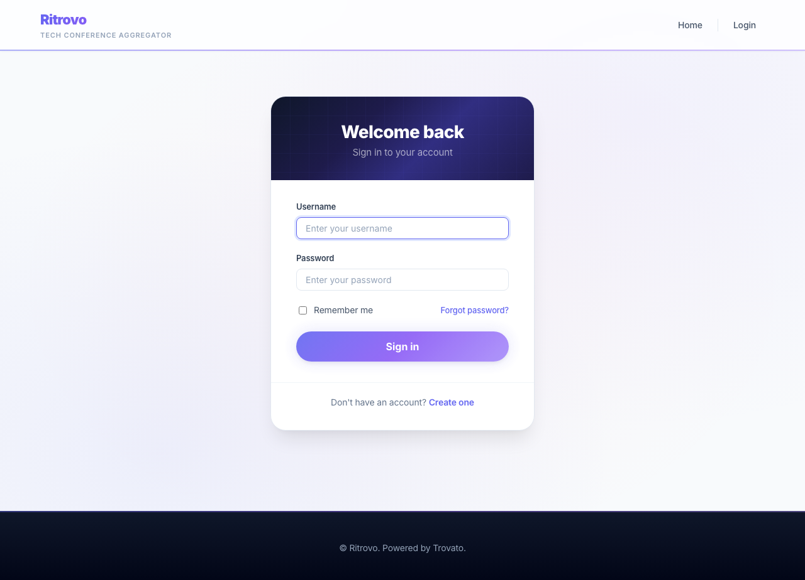

# Part 9: AI & Intelligent Search

Your conference site has content, structure, editorial workflow, community features, internationalization, and production infrastructure. Now you teach it to think. This part covers Trovato's AI integration — provider configuration, content enrichment, intelligent search with Scolta, and the chatbot.

The guiding principle: **AI as infrastructure, not afterthought.** The kernel manages API keys, budgets, and providers so plugins never touch credentials. And critically: **no vector database required.** Scolta provides AI-powered search using Pagefind for client-side indexing and AI for query expansion and summarization — no Elasticsearch, no Solr, no pgvector needed for the default path.

---

## Step 1: Enable the AI Plugin

The `trovato_ai` plugin provides AI features: field rules, form assist buttons, chat actions, and permissions. It ships with Trovato but is disabled by default.

```bash
# Enable the plugin
cargo run --release --bin trovato -- plugin enable trovato_ai

# Restart the server
# (kill and restart your server process)
```

After restart, verify the plugin is loaded:

```bash
curl -s http://localhost:3000/health
# {"status":"healthy","postgres":true,"redis":true}
```

Check the admin plugins page — `trovato_ai` should show as "Enabled":

[](images/part-ai/plugins-ai-enabled.png)

---

## Step 2: Configure an AI Provider

Trovato supports OpenAI-compatible and Anthropic providers. API keys are stored as **environment variable references** — the database stores the variable name (e.g., `ANTHROPIC_API_KEY`), never the key itself. The kernel resolves the key from the environment at runtime. WASM plugins never see the key.

### Set the API Key

Add your API key as an environment variable:

```bash
# In your .env file (gitignored):
ANTHROPIC_API_KEY=sk-ant-...

# Or export directly:
export ANTHROPIC_API_KEY=sk-ant-...
```

### Configure the Provider

Navigate to **Admin > AI Providers** (`/admin/system/ai-providers`):

[](images/part-ai/ai-config-providers.png)

Add a provider:
- **Label:** Anthropic
- **Protocol:** Anthropic
- **Base URL:** `https://api.anthropic.com/v1`
- **API Key Env Var:** `ANTHROPIC_API_KEY`
- **Model for Chat:** `claude-sonnet-4-20250514`
- **Rate Limit:** 30 requests/minute

Set Anthropic as the default provider for Chat operations in the "Default Providers" section.

### Test the Connection

Click "Test Connection" next to the provider. A green checkmark confirms the key is valid and the provider is reachable.

---

## Step 3: Token Budgets & Usage

Monitor AI costs and set per-role limits at **Admin > AI Budgets** (`/admin/system/ai-budgets`):

[](images/part-ai/ai-budgets.png)

The dashboard shows:
- **Usage this month** — total tokens by provider and total requests
- **Top users** — who's using the most AI tokens
- **Budget configuration** — set maximum tokens per period for each role

Budget enforcement modes:
- **Deny:** Reject the request when budget is exceeded
- **Warn:** Allow but log a warning
- **Unlimited:** Leave blank for no limit

---

## Step 4: AI Assist on Content Forms

With `trovato_ai` enabled, content editing forms gain **AI Assist** buttons next to text fields. These appear on the admin content forms at `/admin/content/add/{type}` and `/admin/content/{id}/edit`.

[](images/part-ai/content-form-ai-assist.png)

Click "AI Assist" to open a popover with five operations:

| Operation | What It Does |
|---|---|
| **Rewrite** | Improve clarity and flow while preserving meaning |
| **Expand** | Add more detail and supporting information |
| **Shorten** | Reduce to roughly half length, keeping key points |
| **Translate** | Translate to a selected language (10 languages) |
| **Adjust Tone** | Rewrite in a different tone (formal, casual, technical, etc.) |

The AI-transformed text appears as a preview. Click **Accept** to replace the field value or **Reject** to dismiss.

All operations go through `POST /api/v1/ai/assist` — same provider, same budget, same rate limits.

### Test It

```bash
# Log in and get a CSRF token
CSRF=$(curl -s -b cookies.txt http://localhost:3000/admin \
  | grep -oE 'csrf-token" content="[a-f0-9]+"' | grep -oE '[a-f0-9]{64}')

# Test AI assist
curl -s -b cookies.txt \
  -X POST http://localhost:3000/api/v1/ai/assist \
  -H "Content-Type: application/json" \
  -H "X-CSRF-Token: $CSRF" \
  -d '{"text": "A conference about Rust.", "operation": "expand"}'
# Returns: {"result": "..expanded text..", "tokens_used": 150}
```

---

## Step 5: Chat Configuration

Configure the chatbot at **Admin > AI Chat** (`/admin/system/ai-chat`):

[](images/part-ai/ai-chat-settings.png)

Settings include:
- **System prompt** — The chatbot's personality and instructions
- **RAG (Retrieval-Augmented Generation)** — Whether search results are injected as context
- **Model** — Which AI model to use and token limits
- **Conversation** — How many turns of history to retain
- **Rate limiting** — Requests per hour per user

The chatbot is accessible at `POST /api/v1/chat` and renders as a Tile that can be placed in any Slot.

---

## Step 6: Field Rules (Automatic Content Enrichment)

Field rules automate content enrichment — when a conference description changes, AI auto-generates a summary. Rules are configured in site config under `trovato_ai.field_rules` and fire via `tap_item_presave`.

Example rule:
```json
{
  "item_type": "conference",
  "source_field": "field_description",
  "target_field": "field_summary",
  "trigger": "on_change",
  "prompt": "Summarize this conference in 2 sentences: {field_description}",
  "behavior": "fill_if_empty",
  "weight": 0
}
```

Behaviors:
- **fill_if_empty** — Only generate if the target field is blank
- **always_update** — Regenerate on every save
- **suggest** — Store the suggestion without writing to the field

---

## Step 7: Intelligent Search with Scolta

Trovato integrates **Scolta** for AI-powered search that works **without any vector database**. Pagefind handles client-side indexing, and AI enhances the search experience with query expansion and summaries.

### How It Works

1. **Pagefind** builds a static search index from published content (via cron)
2. **scolta.js** runs client-side scoring: recency decay, title/content match boost, deduplication
3. **AI query expansion** — "performance issues" also finds "site speed optimization"
4. **AI summary** — A streaming answer appears above results, citing sources
5. **Follow-up conversation** — Users can ask follow-up questions

### Enable Search Indexing

The `trovato_search` plugin detects content changes and signals the kernel to rebuild the Pagefind index:

```bash
cargo run --release --bin trovato -- plugin enable trovato_search
# Restart server, then trigger cron:
curl -s -X POST http://localhost:3000/cron/default-cron-key | jq '.status'
```

### Search Page

Visit `/search` to see the Scolta search UI:

[](images/part-ai/search-scolta.png)

### Why No Vector Database?

Most sites don't need embeddings for good search. Scolta's approach:

| | Scolta (Pagefind + AI) | Vector Database (pgvector) |
|---|---|---|
| **Infrastructure** | None beyond Trovato | Requires pgvector extension |
| **Index updates** | Automatic via cron | Requires embedding generation per item |
| **AI dependency** | Optional (search works without AI) | Required for embedding generation |
| **Cost** | AI calls only on search queries | AI calls on every content save + search |
| **Best for** | Most sites | Pure semantic similarity use cases |

Start with Scolta. Only add pgvector if you have a specific need for embedding-based similarity that keyword search + AI expansion can't address.

### AI Search Endpoints

When AI is configured, scolta.js automatically uses these endpoints:

| Endpoint | Method | What It Does |
|---|---|---|
| `/api/v1/search/expand` | POST | Returns alternative search terms |
| `/api/v1/search/summarize` | POST | Streams an AI summary of top results |
| `/api/v1/search/followup` | POST | Handles follow-up conversation |

---

## Step 8: MCP Server

The `trovato_mcp` binary exposes Trovato as an MCP (Model Context Protocol) server. External AI tools like Claude Desktop, Cursor, or VS Code can interact with your site's content.

```bash
# Start the MCP server (connects to the same database)
TROVATO_API_TOKEN=your-token cargo run --release --bin trovato-mcp
```

Available MCP tools: content CRUD, search, Gather queries, categories, content types.

---

## What You Built

This part added intelligence to your conference site:

- **AI provider configuration** with secure key management (keys never in database or WASM)
- **AI Assist buttons** on content editing forms for inline text operations
- **Field rules** for automatic content enrichment on save
- **Token budgets** for cost control with per-role limits
- **Chatbot** with streaming responses and RAG context from search
- **Scolta search** — AI-powered search without a vector database
- **MCP server** connecting external AI tools to your content

The AI infrastructure is one `ai_request()` host function that any plugin can call. One plugin (`trovato_ai`) replaces what would be a dozen separate modules in other CMS platforms.

---

## Related

- [Part 3: Look & Feel](part-03-look-and-feel.md) — Pagefind client-side search setup
- [Part 8: Production Ready](part-08-production-ready.md) — Deployment and infrastructure
- [AI Integration Design](../design/ai-integration.md) — Architecture and design decisions
- [Epic 3: AI as a Building Block](../ritrovo/epic-03.md) — Full epic with story details
