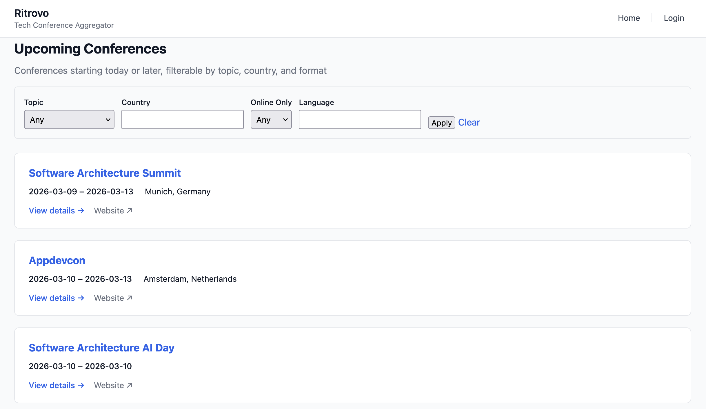

# Image rendering test

## Approach 1: details with blank lines (current)

Figure 1.1: Click to expand

## Approach 2: details with HTML img tag

Figure 1.2: Click to expand

## Approach 3: thumbnail linking to full image

## Approach 4: details with HTML img and explicit width

Figure 1.1 again: Click to expand

 

